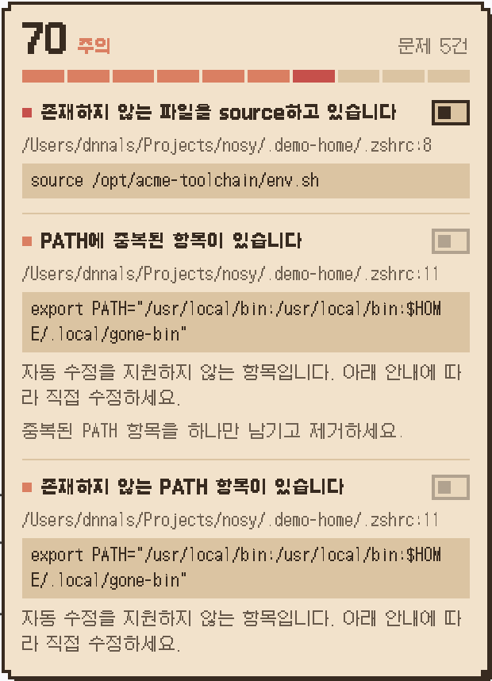
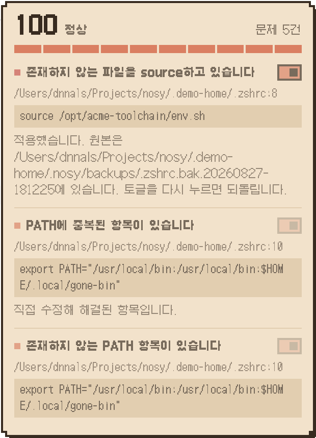
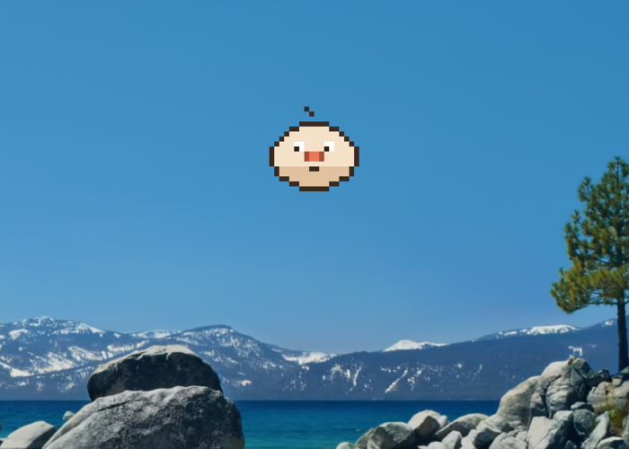

<div align="center">


# Nosy

**개발 환경을 진단하는 데스크톱 펫.**

진단 도구들은 무언가 잘못됐다고 말합니다.<br>
Nosy는 어느 파일 몇 번째 줄을 무슨 명령으로 고치라고 말합니다.

[](https://github.com/2026osscontest/nosy/actions/workflows/ci.yml)
[](https://github.com/2026osscontest/nosy/releases/latest)
[](LICENSE)
[](#요구-사항)

[English](README.md) · **한국어**

</div>

---

<div align="center">
<table>
<tr>
<td width="50%"></td>
<td width="50%"></td>
</tr>
<tr>
<td align="center"><sub><b>수정 전</b> — 오류 1건과 경고 4건. 각각 파일과 줄을 짚는다.</sub></td>
<td align="center"><sub><b>수정 후</b> — 수정이 실행됐고, 원본은 백업됐으며, 토글을 다시 누르면 되돌아간다.</sub></td>
</tr>
</table>
<sub><code>scripts/demo-setup.sh</code>가 만든 격리 환경으로 촬영했다. 실제 홈 디렉터리가 아니다.</sub>
</div>

## 왜 만들었나

셸 설정은 조용히 썩습니다.

몇 달 전 지운 디렉터리를 가리키는 `PATH` 항목, 이제는 없는 바이너리를 가리키는 alias, 존재하지 않는
파일을 부르는 `source` 줄, 파일 중간으로 밀려나 더는 먹지 않는 버전 매니저 초기화 줄. 아무것도
터지지 않습니다. 그저 조금씩 느려지고 미묘하게 어긋나다가, 어느 날 *"제 컴퓨터에선 되는데요"*가
농담이 아니게 됩니다.

이걸 잡아줄 도구들은 흩어져 있고 대체로 눈에 띄지 않습니다. 패키지 매니저와 언어 런타임은 저마다
진단 명령을 갖고 있지만, 대부분의 개발자는 그중 어느 것도 실행해 본 적이 없습니다. 그리고 막상 돌려
보면 출력은 **무엇이** 문제인지만 말할 뿐, **어디를** 고쳐야 하는지는 말해주지 않습니다.

Nosy는 그 검사들을 대신 주기적으로 돌리고, 답을 화면 위에 올려놓습니다 — 파일, 줄 번호, 문제가 된
원문, 그리고 고치는 명령.

## 무엇을 잡아내나

Nosy는 새로운 진단 엔진이 아닙니다. 이미 존재하는 검사들을 — 여기에 자체 검사 몇 가지를 더해 —
하나의 점수 뒤로 모읍니다.

<table>
<tr><th align="left">어댑터</th><th align="left">찾는 것</th></tr>
<tr><td><code>shell-rc</code></td><td>
중복된 <code>PATH</code> 항목 · 존재하지 않는 디렉터리를 가리키는 <code>PATH</code> 항목 ·
대상 명령이 없는 alias · 중복 정의된 alias ·
없는 파일을 부르는 <code>source</code> · 충돌하는 버전 매니저 초기화 줄
</td></tr>
<tr><td><code>version-manager</code></td><td>
시스템 바이너리에 밀린 pyenv/nvm shim ·
활성 버전과 어긋난 <code>.nvmrc</code> / <code>.python-version</code> ·
rc 파일 마지막에 있지 않은 초기화 줄 · 설치됐는데 초기화 줄이 아예 없는 매니저
</td></tr>
<tr><td><code>homebrew</code></td><td>
패키지 매니저 자체 진단 결과를 같은 점수와 형식으로 흡수
</td></tr>
</table>

## 기능

**증상이 아니라 원인을 짚습니다.** 파일에서 비롯된 문제는 경로와 줄 번호, 그리고 문제가 된 원문을
그대로 동반합니다. 파일에서 온 게 아닌 문제는 대신 실행할 수 있는 명령을 동반합니다.
*증상 → 파일:줄 → 고치는 명령* 이 짝이 전부입니다.

**도구를 가로질러 하나의 점수.** 모든 어댑터의 결과가 한 숫자로 접힙니다. 100점에서 시작해 경고마다
5점, 오류마다 15점을 깎되, 어댑터 하나가 최대 30점까지만 깎을 수 있어 시끄러운 도구 하나가 점수를
통째로 끌어내리지 못합니다.

**변화를 알아챕니다.** 매 실행을 마지막 스냅샷(`~/.nosy/snapshots/latest.json`)과 비교합니다. 이전에는
없던 오류가 새로 생기면, 물어볼 때까지 기다리지 않고 펫이 즉시 반응합니다.

**수정은 일부러 소심합니다.** [Nosy가 하지 않는 것](#nosy가-하지-않는-것)을 보세요.

**화면 위에 삽니다.** 투명하고 항상 위에 뜨며 Dock 아이콘이 없습니다. 표정은 점수를 따라갑니다.

<div align="center">

</div>

<div align="center">


<br>
<sub><b>idle</b> · <b>thinking</b> · <b>worried</b> · <b>alarmed</b></sub>
</div>

## 요구 사항

- **macOS 12(Monterey) 이상.** Apple Silicon과 Intel 모두 지원합니다.
- 현재는 macOS 전용입니다. 어댑터가 macOS의 경로와 셸 관례를 전제합니다.

## 설치

### Homebrew

```sh
brew tap 2026osscontest/nosy
brew trust 2026osscontest/nosy
brew install --cask nosy
xattr -dr com.apple.quarantine /Applications/Nosy.app
```

이 중 두 줄은 낯설지만 둘 다 필요합니다.

- **`brew trust`** — Homebrew는 서드파티 tap의 cask를 신뢰 설정 전까지 불러오지 않습니다. 이 줄이
  없으면 설치가 `Refusing to load cask ... from untrusted tap`에서 멈춥니다.
- **`xattr`** — 아래 [이유](#xattr은-왜-필요한가)를 보세요.

### 직접 내려받기

[최신 릴리스](https://github.com/2026osscontest/nosy/releases/latest)에서 자기 Mac에 맞는 `.dmg`를
받아 Applications로 옮긴 뒤 실행하세요.

```sh
xattr -dr com.apple.quarantine /Applications/Nosy.app
```

| Mac | 파일 |
|---|---|
| Apple Silicon | `Nosy-<버전>-arm64.dmg` |
| Intel | `Nosy-<버전>-x64.dmg` |

### `xattr`은 왜 필요한가

Nosy는 ad-hoc 서명은 되어 있지만 **Apple 공증(notarization)을 받지 않았습니다** — 공증에는 유료 Apple
Developer 계정이 필요합니다. macOS는 공증되지 않은 앱을 격리하고 실행을 거부하는데, 위 명령이 그
표시를 지웁니다. 설치당 한 번이면 됩니다.

이 명령을 쓰기 꺼려진다면 앱을 우클릭 → **열기** → **열기**로도 같은 결과를 얻을 수 있습니다. 클릭이
몇 번 더 필요할 뿐입니다.

### 소스에서 빌드

```sh
git clone https://github.com/2026osscontest/nosy.git
cd nosy
pnpm install
pnpm --filter @nosy/core build   # apps/pet이 core의 dist/를 링크합니다
pnpm --filter @nosy/pet dev
```

## 사용법

Nosy는 **Dock 아이콘 없이 메뉴바에 상주**합니다. 펫은 화면 위에 있고, 앱 관리는 메뉴바에서 합니다.

| | |
|---|---|
| **펫 클릭** | 말풍선이 뜨고, 이어서 상세 패널이 열립니다 |
| **상세 패널** | 파일 경로·줄 번호·문제가 된 원문·수정 방법, 그리고 실제로 적용하는 토글 |
| **메뉴바** | 지금 진단하기 · 펫 숨기기 · 움직임 · 로그인 시 자동 시작 · 종료 |

진단은 앱을 켤 때, 30분마다, 절전에서 깨어날 때, 그리고 감시 중인 rc 파일이 바뀔 때 돕니다.

**로그인 시 자동 시작을 끄려면** 메뉴바에서 *로그인 시 자동 시작*의 체크를 해제하세요. 켜지 않는 한
기본은 꺼짐입니다.

## 동작 방식

```
    어댑터                        core                        pet
┌───────────────┐      ┌────────────────────┐      ┌──────────────────┐
│ shell-rc      │      │                    │      │                  │
│ version-      │─────▶│  Finding[]         │─────▶│  헬스 스코어      │
│   manager     │      │   ├─ evidence      │      │  펫 표정          │
│ homebrew      │      │   │   file:line    │      │  상세 패널        │
└───────────────┘      │   └─ fix           │      └──────────────────┘
        ▲              │       command      │
        │              │       or edit      │
   DiagnosticHost      └─────────┬──────────┘
   (파일시스템·셸 접근은          │
    전부 여기를 지납니다)          ▼
                           ~/.nosy/snapshots
                           비교 → 드리프트
```

모든 어댑터는 `DiagnosticHost`를 주입받아 오직 그것을 통해서만 파일시스템과 셸에 닿습니다. 이 이음매
하나가 실제 머신 없이도 어댑터를 테스트할 수 있게 하고, 새 어댑터를 쓰기 쉽게 만듭니다.
[CONTRIBUTING.md](CONTRIBUTING.md)를 참고하세요.

## Nosy가 하지 않는 것

Nosy는 여러분의 셸 설정을 고칩니다. 그렇다면 한계를 명시해야 마땅합니다.

- **`sudo`를 대신 실행하지 않습니다.** 권한 상승이 필요한 명령은 복사할 수 있게 보여줄 뿐, 실행하지
  않습니다.
- **고치기 전에 백업합니다.** 수정하는 모든 파일을 먼저 `<파일>.bak.<타임스탬프>`로 복사합니다.
- **먼저 물어봅니다.** 명시적인 확인 없이는 어떤 수정도 실행되지 않습니다.
- **파괴적인 일은 하지 않습니다.** 파일·패키지 삭제와 전역 설정 초기화는 수정 대상에서 아예
  제외했습니다 — 경고를 띄우고 막는 게 아니라 제외입니다.
- **되돌릴 수 없으면 되돌리기를 비활성화합니다.** 되돌릴 경로가 없는 수정은 되돌리기 버튼이 회색으로
  꺼집니다. 거짓말하지 않습니다.
- **아무것도 밖으로 보내지 않습니다.** 진단은 로컬에서만 돕니다. 텔레메트리도, 네트워크 호출도, 계정도
  없습니다. 스냅샷은 `~/.nosy/`에 남습니다.

## 로드맵

- `git`·`docker` 어댑터 — 명세는 작성됐고 구현이 남았습니다
- 영어 UI
- MCP로 진단 노출 — 코딩 에이전트가 코드를 탓하기 전에 환경을 먼저 확인할 수 있도록
- Linux·Windows 어댑터
- 3D 캐릭터 (렌더러를 단일 컴포넌트로 격리해 두어, 다시 쓰는 게 아니라 갈아 끼우면 됩니다)

## 기여

버그 리포트, 오탐 신고, 새 어댑터, 문서 모두 환영합니다.

**오탐 신고는 가장 값진 제보입니다** — 없는 늑대를 외치는 진단 도구는 없느니만 못합니다. Nosy가
멀쩡한 것을 문제라고 했다면
[알려주세요](https://github.com/2026osscontest/nosy/issues/new?template=false-positive.yml).

개발 환경 준비, 아키텍처 규칙, 새 어댑터를 쓰는 방법은 [CONTRIBUTING.md](CONTRIBUTING.md)에 있습니다.

## 라이선스

[MIT](LICENSE).

모든 의존성의 라이선스를 검토했다 — 트리 전체에 GPL·AGPL·LGPL이 없다. 상세 내역은
[`docs/LICENSE-AUDIT.md`](docs/LICENSE-AUDIT.md)에 있고, CycloneDX SBOM은
[릴리스](https://github.com/2026osscontest/nosy/releases/latest)마다 자산으로 첨부한다.

### 감사의 말

- **[shellrc-doctor](https://github.com/nord342/shellrc-doctor)** (MIT) — `shell-rc` 어댑터가 딛고 선
  셸 rc 진단 아이디어. 런타임에 호출하지 않고 TypeScript로 새로 구현했습니다.
- **[Galmuri](https://github.com/quiple/galmuri)** (SIL OFL 1.1) — 펫 말풍선에 쓰는 픽셀 폰트.

전문은 [THIRD-PARTY-NOTICES.md](THIRD-PARTY-NOTICES.md)에 있습니다.
